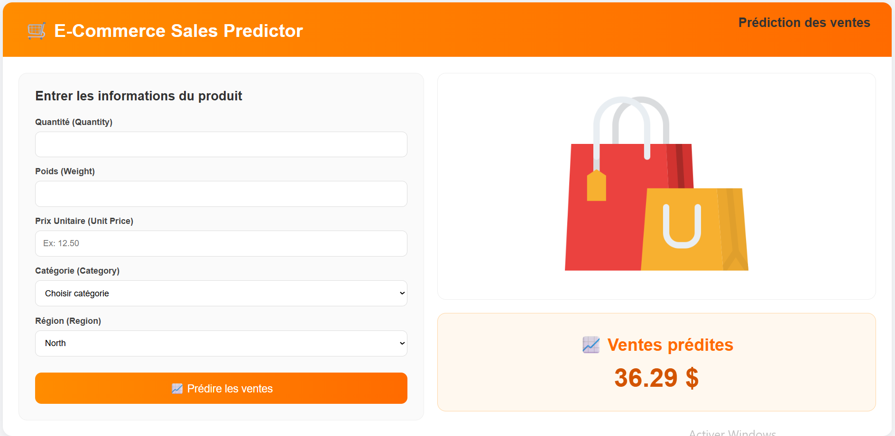

# 🛒 E-Commerce Sales Prediction

## Présentation

Ce projet consiste à développer un modèle de **Machine Learning** capable de prédire les ventes dans le domaine du e-commerce à partir de différentes caractéristiques liées aux produits.

L’objectif est d’analyser les données commerciales et de construire un modèle prédictif permettant d’estimer le montant des ventes avec précision.

---

## Objectif

Le projet vise à :

- analyser les données de ventes ;
- identifier les variables influençant les ventes ;
- entraîner un modèle de prédiction performant ;
- estimer automatiquement les ventes futures.

---

## Variables utilisées

La prédiction est basée sur plusieurs caractéristiques :

- **Quantité**
- **Poids**
- **Prix unitaire**
- **Catégorie**
- **Région**

---

## Méthodologie

Le projet suit les principales étapes  :

- préparation et nettoyage des données ;
- analyse exploratoire des données ;
- transformation et encodage des variables ;
- entraînement du modèle ;
- évaluation des performances ;
- sauvegarde du modèle final.

---

## Technologies utilisées

- **Python**
- **Pandas**
- **NumPy**
- **Scikit-learn**
- **XGBoost**
- **Jupyter Notebook**

---

## Résultat

Le modèle développé permet de prédire les ventes de manière fiable et peut servir d’outil d’aide à la décision pour améliorer la planification commerciale et la gestion des ressources.

